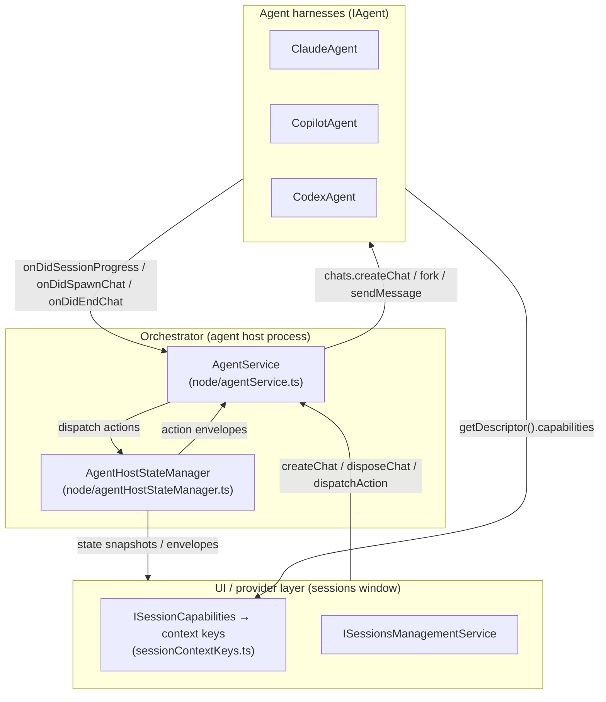
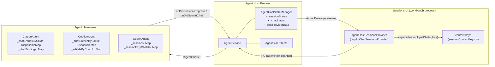
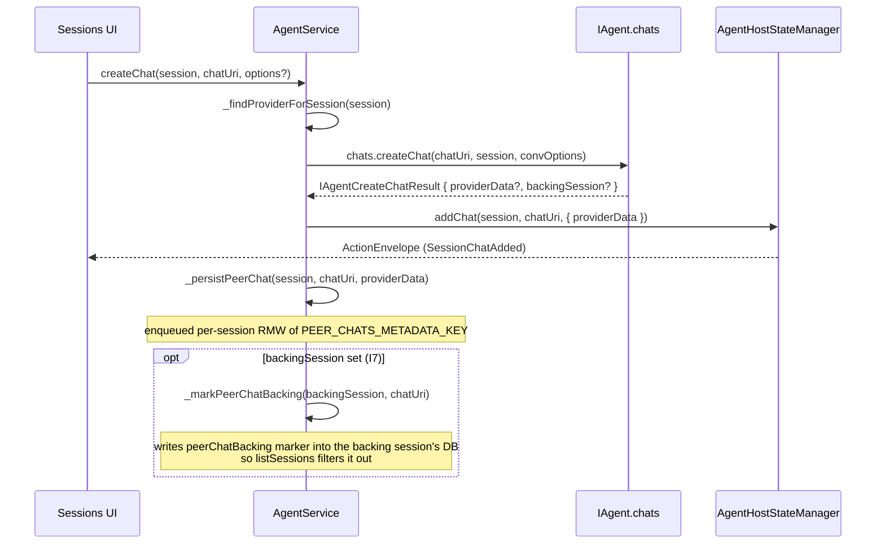
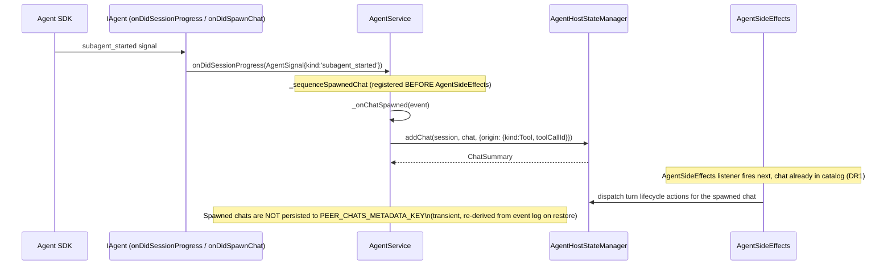
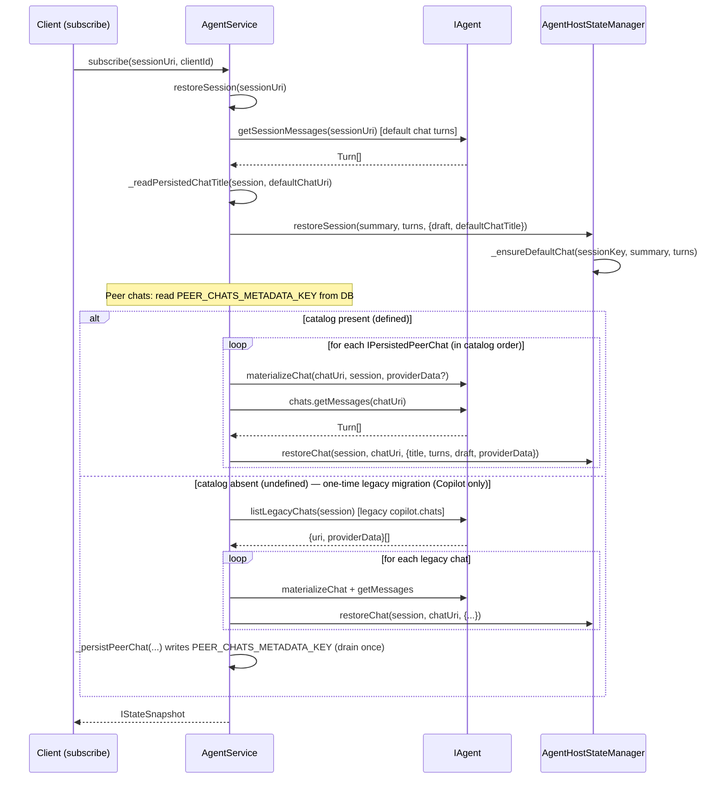
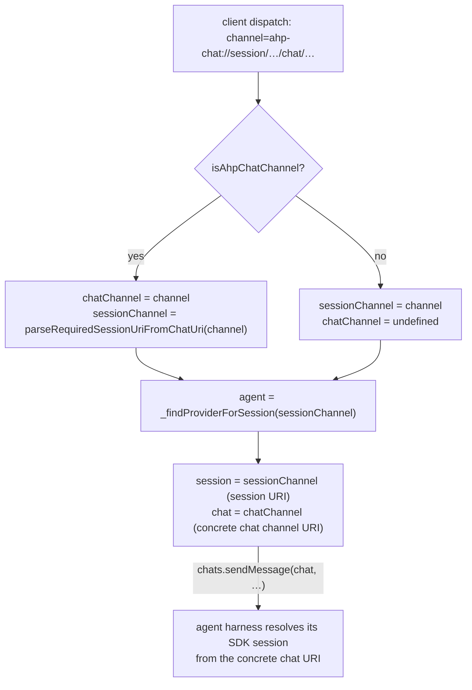

<!--
  MULTI_CHAT_ARCHITECTURE.md
  Living spec — keep in sync with code after each significant change.
  See: node/agentService.ts, node/agentHostStateManager.ts,
       node/claude/claudeAgent.ts, node/copilot/copilotAgent.ts,
       node/codex/codexAgent.ts, node/agentSideEffects.ts,
       common/agentService.ts (IAgent, IAgentChats, IAgentCapabilities).
-->

# Multi-Chat Architecture

> **Status: COMPLETE** (2026-07-01)
> All waves A–D and gates G-B1, G-C1, G-C2, G-D1 are done. Codex, Claude, and
> Copilot all use the unified orchestrator path.
>
> The *operational* chat surface (send/abort/model/agent/history) is fully
> chat-addressed and uniform across harnesses. Session ownership lives in the
> orchestrator: it drives every harness through the chat-surface seam — see
> [§7 Session Ownership (T2/T4)](#7-session-ownership-t2t4--the-orchestrator-owns-the-session).

---

## 1. Mental Model

### Three distinct concepts

| Term | What it is | Owner |
|------|-----------|-------|
| **Session** (SDK-level) | The SDK-level session: working directory, active client, tool permissions, restore identity. Owns the default chat implicitly. | Agent harness |
| **Chat** | A thread of turns addressed by a chat channel URI. AH owns its URI and membership; the agent owns its SDK backing. | `AgentService` + agent harness |
| **Orchestrator session** | The protocol-visible entity that bundles a session with its chat catalog, state, and persistence. The orchestrator owns the catalog (which chats exist), the default-chat pointer, and all persistence. | `AgentService` + `AgentHostStateManager` |

### Guiding principles

- **"Represent, don't orchestrate."** The agent harness creates and drives SDK
  chats; the orchestrator records what exists and routes protocol
  actions. No agent-specific logic leaks into `AgentService` or
  `AgentHostStateManager`.
- **Composition over inheritance.** All harnesses share one membership path
  (`addChat`/`removeChat`), one persistence path (`PEER_CHATS_METADATA_KEY`),
  and one restore path (`restoreChat`). Per-harness features are expressed
  through `IAgentCapabilities` flags, not `if (provider === 'claude') ...`
  branches.
- **Single catalog path.** Whether a chat is created by the user ("Add Chat")
  or spawned by the harness (subagent tool call), it enters the catalog through
  exactly one path (`AgentHostStateManager.addChat`). See invariant I4 below.

### Terminology convention: "session" is overloaded — read it by layer

The word **session** means two different things depending on which side of the
seam you are on. To avoid confusion, follow this convention:

| Where | What `session` means | Notes |
|-------|----------------------|-------|
| AHP wire protocol (`common/state/protocol/`) and the orchestrator (`AgentService`, `AgentHostStateManager`) | The **AH session** — the protocol-visible grouping of a default chat plus its peer chats. | This is the vocabulary the generated protocol types pin (`SessionState`, `SessionSummary`, `sessionAdded`, ...); it is immutable and authoritative. |
| Inside an agent harness (`node/claude`, `node/copilot`, `node/codex`) | The agent's **own SDK / provider session** — the provider's native concept (Codex calls it a *thread*). The agent has no notion of the AH grouping; it only ever deals in chats and its own SDK sessions. | Prefer the provider's native term where one exists (Codex "thread"); otherwise spell it out as "SDK session" / "provider session" in comments and local names wherever the two could be confused. |
| The `IAgent` seam (`createSession` / `disposeSession` / `releaseSession`, `session: URI`) | A **shared identity**: the URI is AH-minted (`AgentSession.uri`), but by invariant I3 its raw id *is* the SDK session id, so both sides agree on identity without importing each other's concept. | These few methods legitimately keep the name `session`. Chat-addressed operations do **not** — they were renamed to conversation/chat (e.g. `getConversationMetadata`, `listConversations`, `chats.*`). |

**Why we do not rename the agents' "SDK session" symbols:** the generated
protocol fixes "Session" = AH session across hundreds of references we cannot
change, and the `IAgent` seam genuinely passes AH session URIs. Renaming the
provider-internal concept to `providerSession` would create a new inconsistency
against the protocol rather than removing one. The durable fix is this
convention plus the chat-addressed rename of the operational surface, not a
symbol-level rename of "session".

---

## 2. Ownership and Layering



### Agent layer (`common/agentService.ts:IAgent`)

Responsible for:
- Creating and owning SDK chats (`chats.createChat`, `chats.fork`).
- Reading history (`chats.getMessages`).
- Emitting progress signals (`onDidSessionProgress`).
- Emitting membership events for harness-spawned chats (`onDidSpawnChat`, `onDidEndChat`).
- Re-attaching a peer chat's backing on restore (`materializeChat`).
- Advertising static capability flags (`getDescriptor().capabilities`).

Agents do **not** maintain the chat catalog, persist membership, or know about the orchestrator's URI mapping.

### Orchestrator layer

**`AgentService` (`node/agentService.ts`):**
- Owns the `(session, chat)` → `(agent, session URI, chat URI)` mapping.
- Owns `_providers`, `_sessionToProvider`, and `_findProviderForSession` (which falls back through the session URI's scheme when a session was restored without a `createSession` call in this process lifetime).
- Dispatches user-driven chat lifecycle (`createChat`, `disposeChat`) to `chats.*`.
- Disposes and releases every catalog chat in stable order: peers first, default last.
- Fans session config changes out to concrete chats for chat-addressed providers.
- Persists and restores the orchestrator-owned peer-chat catalog (`PEER_CHATS_METADATA_KEY` in the session database, serialized per session via `_peerChatCatalogWrites`).
- Suppresses a peer chat's separately-enumerable backing SDK session (when `IAgentCreateChatResult.backingSession` is set): marks it via `_markPeerChatBacking` and filters it out of `listSessions` (invariant I7).
- Routes harness-spawned chats into the catalog (`_onChatSpawned`, `_onChatEnded`).
- Owns the restore flow (`restoreSession`, `_restorePeerChats`).

**`AgentHostStateManager` (`node/agentHostStateManager.ts`):**
- Holds the authoritative in-memory state tree:
  - `_sessionStates: Map<string, ISessionEntry>` — per-session `SessionState` + catalog timestamps.
  - `_chatStates: Map<string, ChatState>` — per-chat state (turns, activeTurn, draft).
  - `_chatProviderData: Map<string, string>` — opaque `providerData` blobs keyed by peer-chat URI; never parsed.
- Owns `_ensureDefaultChat`: creates the default `ChatState` (URI derived deterministically from the session URI via `buildDefaultChatUri`) at create/restore time.
- `addChat`/`restoreChat`/`removeChat`: the single path for catalog membership changes.
- Session-level active-turn tracking via `_sessionsWithActiveTurn` (a set of chat URIs per session, so multi-chat sessions running concurrent turns stay correct).

### UI/provider layer (`sessions/services/sessions/common/session.ts:ISessionCapabilities`)

- Protocol `AgentCapabilities` (`multipleChats?: { fork?: boolean }`) flows from `AgentInfo.capabilities` (protocol) through the provider adapter into `ISession.capabilities` (`ISessionCapabilities`), whose `supportsMultipleChats`/`supportsFork` flags derive from the presence of `multipleChats` and `multipleChats.fork`, and from there into VS Code context keys (`sessionContextKeys.ts:SessionSupportsMultipleChatsContext`, `SessionSupportsForkContext`).
- UI actions read context keys — no provider-id switches.

---

## 3. Key Invariants

**I1 — `providerData` is opaque.**
`AgentHostStateManager._chatProviderData` stores the blob returned by `chats.createChat` verbatim. Neither `AgentService` nor `AgentHostStateManager` ever parses, validates, or mutates it. It is round-tripped to the agent verbatim on restore via `materializeChat(chat, providerData)`.

**I2 — `sessionUri` and `chatChannelUri` are never overloaded.**
A session URI (`ahp-copilot://`, `ahp-claude://`, …) identifies a session. A chat channel URI (`ahp-chat://…`) identifies a chat within a session. The two schemes are structurally distinct; `isAhpChatChannel` / `parseDefaultChatUri` / `buildDefaultChatUri` are the only crossing points. Passing a chat URI where a session URI is expected (or vice versa) is a bug.

**I3 — The default chat's backing SDK session IS the session.**
The default chat's URI is derived deterministically from the session URI (`buildDefaultChatUri(sessionUri)`), and its backing SDK session id equals the session raw id. Peer chats can have independent SDK session ids (`IPersistedChat.sdkSessionId`). This identity rule does not give the agent ownership of chat grouping: AH's `SessionState.chats` and `defaultChat` remain authoritative and drive lifecycle/config fan-out.

**I4 — Single catalog path (spawn channel).**
Both user-driven chats (`AgentService.createChat` → `addChat`) and harness-spawned chats (`AgentService._onChatSpawned` → `addChat`) go through `AgentHostStateManager.addChat`. The spawn-channel listener is registered **before** `AgentSideEffects` during `registerProvider` (`node/agentService.ts:registerProvider`) to guarantee the chat exists in the catalog before any turn actions arrive for it (DR1 deterministic sequencing).

**I5 — Orchestrator peer-chat catalog is the restore source of truth (with one-time legacy migration).**
After Wave C2, the orchestrator persists its own peer-chat catalog (`PEER_CHATS_METADATA_KEY`) alongside the session database. On restore, `_restorePeerChats` reads that catalog. When it is **absent** (`undefined` — a session persisted before the orchestrator owned the catalog), a one-time migration (`_migrateLegacyPeerChats`) enumerates the agent's legacy `*.chats` via `IAgent.listLegacyChats` (only **Copilot** implements it — mapping its `_readPersistedChats` entries to `{ uri: buildChatUri(session, chatId), providerData: encodeProviderData(info) }`; Claude and Codex omit it, so `listLegacyChats` falls to its optional-undefined default and nothing is drained), restores them through the same catalog path, then writes `PEER_CHATS_METADATA_KEY` so subsequent restores read the new catalog and never consult the legacy read again. An **empty** catalog (`[]`) is "known-empty" and skips migration. Harness-spawned chats (subagents) are NOT in the catalog — they are transient and re-derived from the parent's event log on restore. (Claude has no legacy `claude.chats` blob: Claude multi-chat shipped only with the orchestrator-owned catalog, so there was never a pre-catalog format to migrate.)

**I6 — `_findProviderForSession` not `_sessionToProvider`.**
The `_sessionToProvider` map is populated only by `createSession`. A restored session (alive in the state manager after a host restart but never created in this process) is absent from it. `_findProviderForSession` (`node/agentService.ts:AgentService._findProviderForSession`) falls back to the session URI scheme, which is what makes restored sessions work.

**I7 — A peer chat's backing SDK session must never surface as a top-level session.**
Some agents (e.g. Claude) back a peer chat with a fresh top-level SDK session minted in the same global store their own `IAgent.listSessions` enumerates, so the backing would leak into the session list as a phantom session. To suppress it, `IAgentCreateChatResult` carries an optional **first-class, non-opaque** `backingSession: URI` (distinct from the opaque `providerData` of I1 — the orchestrator reads it but still never parses `providerData`). On `createChat`, the orchestrator writes a persisted `peerChatBacking` marker (value = the owning peer chat's URI) into that backing session's own database (`_markPeerChatBacking`), and `AgentService.listSessions` drops any enumerated session whose database carries that marker (batched into the existing metadata-overlay read, mirroring the subagent filter). Because the marker is persisted, the suppression survives a host restart with no re-stamping. Agents whose peer chats do not have a separately-enumerable backing session (e.g. Copilot, whose peer SDK sessions live in the chat's data dir and are dropped by its own `listSessions`) may leave `backingSession` unset; Copilot sets it anyway for uniformity, which is harmless.

---

## 4. Capabilities Gating

`AgentCapabilities` (`common/state/protocol/channels-root/state.ts:AgentCapabilities`) is the protocol-level contract:

```typescript
interface AgentCapabilities {
    // presence (`{}`) signals multi-chat support; absence = unsupported
    multipleChats?: {
        fork?: boolean;               // can fork a chat from a turn
    };
}
```

The agent declares these in `getDescriptor().capabilities` (`common/agentService.ts:IAgentDescriptor`). They flow to the UI as `ISessionCapabilities` (`sessions/services/sessions/common/session.ts`) and are bound to context keys (`sessions/services/sessions/common/sessionContextKeys.ts:SessionSupportsMultipleChatsContext`, `SessionSupportsForkContext`).

UI code gates "Add Chat" and "Fork" actions on those context keys. No code inside `AgentService` or `AgentHostStateManager` switches on provider id to gate features. `AgentService.createChat` throws synchronously when `!provider.chats` (the structural guard that replaces a capability check in the orchestrator).

---

## 5. Diagrams

### 5a. Ownership/Component



### 5b. Sequence: User-Driven Add Chat



### 5c. Sequence: Harness-Spawned Chat (Subagent via Spawn Channel)



### 5d. Sequence: Restore



### 5e. The (session, chat) to (agent, session URI, chat URI) Mapping



The orchestrator resolves the owning **session** from the session URI for session-scoped work, but passes a concrete **chat channel URI** to `IAgentChats` operations. For the default chat, that is `buildDefaultChatUri(sessionUri)`, not the bare session URI. Agents encapsulate the SDK fact that the default chat's backing SDK session id is the session id.

---

## 6. Per-Agent Notes

### Claude (`node/claude/claudeAgent.ts`)

Claude deliberately has no AH-session container and no membership/role concept of its own:
- `_chatEntriesBySdkId: DisposableMap<string, ClaudeChatEntry>` is the single disposable owner of every live SDK conversation and provides direct SDK-callback routing.
- `_chatBindings: Map<string, IClaudeChatBinding>` is the one concrete binding map, keyed by the exact host-supplied chat URI, holding `{ sdkSessionId, session, storageUri?, model? }`. `session` is the owning session AH supplied explicitly at bind time (Claude never parses it back out of the chat URI). `storageUri` is present only for the one chat AH stamped as the session's durable storage scope; every other (additional) chat binding simply has it unset — there is no separate discriminator field.
- `IClaudeChatBinding` is the single source of truth for both live and released chats: releasing a chat drops its `_chatEntriesBySdkId` leaf but keeps the binding so a later send can cold-resume from `sdkSessionId`/`model` alone.

Every chat operation resolves exactly one binding and routes to exactly one leaf; there is no default-vs-additional branch and no cascade between chats of the same session. An additional chat's send after restart materializes only that chat and never creates a provisional storage-scoped conversation. Capabilities remain `multipleChats: { fork: true }`.

Each additional chat is backed by a fresh top-level SDK session (`sdkSessionId = generateUuid()`) minted in the same global Claude project store that `listSessions` enumerates. `_createChat` therefore returns `backingSession: AgentSession.uri(this.id, sdkSessionId)` so the orchestrator can suppress that backing from the top-level session list (invariant I7); without it the additional chat would leak as a phantom session. The SDK exposes no delete-chat RPC, so `disposeChat` leaves the backing transcript on disk — the orchestrator-owned catalog simply drops the entry so it is never resumed again. (Claude writes no legacy `claude.chats` blob and has no legacy migration: Claude multi-chat shipped only with the orchestrator-owned catalog, so there is nothing to drain. Copilot keeps its own `copilot.chats` migration because `copilot.chats` predates the catalog.)


### Copilot (`node/copilot/copilotAgent.ts`)

Copilot also has no AH-session container:
- `_chatEntriesBySdkId: DisposableMap<string, CopilotChatEntry>` owns every live SDK conversation and its MCP/customization subscriptions.
- `_sdkIdsByChatUri: Map<string, string>` routes each concrete host chat URI to exactly one SDK conversation; SDK callbacks route directly by SDK id.
- Direct `createSession` fork/import results can remain unbound in the SDK-id owner until AH calls `bindSessionChat` with the concrete chat URI.
- `_chatBackings: Map<string, IPersistedChat>` remains peer-only provider metadata and preserves the existing `providerData` codec and one-time `copilot.chats` migration.

No `CopilotSessionEntry`, `AgentSessionEntry`, default-chat URI helper, or sibling cascade remains. Send/history/model/agent/abort/tool/config/dispose/release operations resolve one leaf. Active-client state remains keyed by the owning SDK session where it is genuinely shared, while each live leaf owns its own SDK and MCP lifecycle. Capabilities remain `multipleChats: { fork: true }`.

### Codex (`node/codex/codexAgent.ts`)

Codex remains a single-chat harness, but its sole SDK thread is explicitly bound to the concrete chat URI AH supplies:
- `_sessions: Map<string, ICodexSession>` owns thread/session state by Codex session id.
- `_sessionIdByChatUri: Map<string, string>` is the exact chat-operation routing index; unbound chat URIs are rejected.
- `_sessionIdByThreadId` continues to route app-server callbacks by thread id.
- `bindSessionChat` attaches restored/forked direct-create threads before history or operations; provision binds at creation.

Codex never recognizes or derives a default-chat URI. `chats.createChat` and `chats.fork` still throw because `multipleChats` is unsupported; exact disposal affects only the bound thread. The persisted `codex.threadId`, `codex.cwd`, and `codex.model` keys and app-server protocol are unchanged.

---

## 7. Session Ownership (T2/T4) — the orchestrator owns the Session

**Status: implemented — the orchestrator drives every harness through the chat surface unconditionally.**

Earlier the agent harness co-owned the *Session* type: it implemented
`createSession`/`disposeSession`/`listSessions`/`getSessionMetadata` and kept an
outer per-session grouping. T2/T4 makes the orchestrator own the Session concept
entirely — identity, lifecycle, and grouping — while the agent talks only in
chats. The tension that made this "contested" (session provisioning is
agent-specific, so relocating it would leak agent logic into `AgentService`,
violating §1) is resolved by a seam: **the orchestrator owns the session
concept; the agent still runs its provisioning, but invoked through the chat
surface rather than a Session-typed method.**

### The seam

- **Create.** `AgentService._provisionSessionViaDefaultChat` allocates the session
  URI (reusing a client-supplied one), derives the default-chat URI
  (`buildDefaultChatUri`), and calls `agent.chats.createChat(defaultChatUri, {
  provisionSession })`. The agent-specific provisioning (working directory /
  scratch dir, git project probe, permission mode, provisional SDK construction)
  runs *inside* creating that default chat — it never moves into the
  orchestrator. The agent returns `IAgentCreateChatResult.provision`
  (`{ workingDirectory?, project?, provisional? }`), which the orchestrator maps
  back to the legacy `IAgentCreateSessionResult` shape so provisional /
  `onDidMaterializeSession` / deferred-`sessionAdded` semantics are preserved.
  The orchestrator's `defaultChatUri` is the authority: `_provisionDefaultChat`
  threads it straight into `createSession` (its optional `defaultChat` argument),
  which seeds the session entry with that URI verbatim rather than decoding it to
  a session and re-deriving the identical URI. Copilot has no synchronous create
  seed (it stores a provisional session and materializes on first send), so it
  has no provision round-trip to thread.
- **Dispose/release.** `AgentService` reads the authoritative chat catalog and
  calls `chats.disposeChat` (or optional `chats.releaseChat`) for every chat,
  peers first and the default last. Each chat hook is exact; an agent never
  cascades from the default chat to siblings. Providers without `releaseChat`
  retain the legacy `releaseSession` fallback.
- **Config.** `AgentSideEffects` fans merged session config values out through
  optional `onChatConfigChanged(chat, values)`. Providers without it retain the
  legacy `onSessionConfigChanged` hook.
- **Enumerate.** `AgentService._enumerateProviderSessions` calls
  `agent.listConversations()` (each entry is an `IAgentConversationMetadata`
  addressed by a chat URI) and groups them into sessions via the default-chat URI
  convention (`parseDefaultChatUri`): a conversation whose chat URI is a session's
  default-chat URI *is* that session; peer-chat conversations are grouped under
  their session (restored via the peer-chat catalog) and never surface as
  top-level sessions.

### No provider-side default-chat derivation

AH supplies both the chat URI and its owning session explicitly on every `createChat`/`fork`/`materializeChat` call, during provision, fork/import binding, and restore alike — no harness ever recovers the owning session by decoding the chat URI. Claude and Copilot record that `(chat, session)` pair in their flat routing indexes; Codex records it in its single-chat index. Direct SDK-created conversations remain temporarily unbound until AH calls `bindSessionChat`. No harness calls `defaultChatUriForSession`, `buildDefaultChatUri`, `parseDefaultChatUri`, or `isDefaultChatUri` to derive an owning session from a chat URI.

### Storage-preservation

The seam is the single path for every harness — there is no per-agent opt-in
flag; the orchestrator always provisions/disposes/enumerates through the chat
surface, and every harness (Claude, Copilot, Codex) implements it. It is
**storage-preserving**: session URIs (and the derived `sdkSessionId == session raw
id`, invariant I3) are unchanged, agents read/write the same SDK stores, and
`providerData` / `PEER_CHATS_METADATA_KEY` formats are untouched. There is no data
migration.

### Interface surface

`IAgent` no longer exposes `listSessions` or `getSessionMessages` — they are
superseded by `listConversations` and `chats.getMessages`. Each harness keeps
those as private methods its own chat/conversation bridge delegates to.

`createSession` and `disposeSession` remain on `IAgent`: they are the
session-lifecycle provisioning primitives the chat-surface bridge delegates to
(`chats.createChat({ provisionSession })` / `chats.disposeChat(defaultChat)`).
`createSession` is additionally still called directly for the **fork/import**
create path. This is a permanent, by-design exception rather than debt: a fork's
session id is minted server-side by the SDK (`sessions.fork`), so the orchestrator
cannot pre-allocate the session URI the way the provisioning seam requires. The
fork/import caller therefore stays on `createSession` and adopts the
server-minted id after the fact.

Per-session metadata lookup is exposed as `getConversationMetadata(chat)` (renamed
from `getSessionMetadata`): it is addressed by a chat URI and returns the same
`IAgentConversationMetadata` shape as `listConversations`, keeping the single-item
and list lookups terminologically aligned. It remains a genuine single-conversation
fast path — the orchestrator maps the default-chat URI back to a session when it
hydrates restore metadata.
