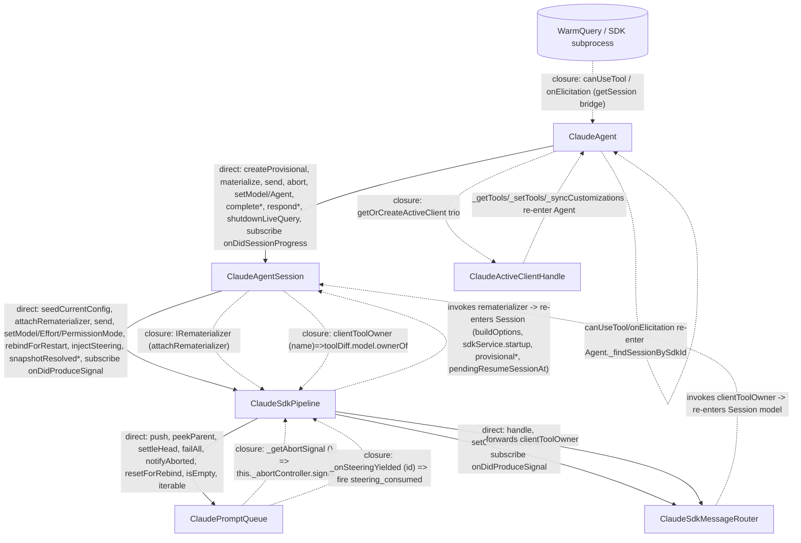

# Claude Agent Host — Call Graph & Closure Inventory

Analysis of coupling among the four runtime modules:

- **ClaudeAgent** — `claudeAgent.ts` (provider / `IAgent`, owns `_sessions`, sequencers, proxy)
- **ClaudeAgentSession** — `claudeAgentSession.ts` (per-chat coordinator, Materialization, rematerializer builder)
- **ClaudeSdkPipeline** — `claudeSdkPipeline.ts` (one WarmQuery lifecycle, consumer loop, rebind)
- **ClaudePromptQueue** — `claudePromptQueue.ts` (the async-iterable prompt buffer handed to `WarmQuery.query()`)

Supporting seam modules: `claudeCanUseTool.ts`, `claudeElicitationBridge.ts`, `claudeSdkMessageRouter.ts`, `clientTools/claudeSessionClientToolsModel.ts`.

Every claim is line-cited against source at the time of writing.

---

## 1. Directed module graph

Solid arrows = **direct method calls** (a holds a typed reference to b). Dotted arrows = **closure/callback injection** (a builds a `this`-capturing closure and hands it to b; b invokes it, re-entering a). The dotted edges are exactly the direct edges that are *missing* — the pipeline holds no reference to the session, the queue holds no reference to the pipeline, the session/router hold no reference to the agent.



Text form of the same edges:

```
ClaudeAgent  --direct-->  ClaudeAgentSession        (owns _sessions, drives whole lifecycle)
ClaudeAgentSession  --direct-->  ClaudeSdkPipeline   (owns _pipeline)
ClaudeSdkPipeline  --direct-->  ClaudePromptQueue    (owns _queue)
ClaudeSdkPipeline  --direct-->  ClaudeSdkMessageRouter (owns _router)

ClaudeSdkPipeline  ==closure==>  ClaudeAgentSession   (IRematerializer, the only Pipeline->Session channel)
ClaudePromptQueue  ==closure==>  ClaudeSdkPipeline    (_getAbortSignal, _onSteeringYielded — the only Queue->Pipeline channels)
ClaudeSdkMessageRouter ==closure==> ClaudeAgentSession (clientToolOwner -> toolDiff.model.ownerOf)
SDK subprocess     ==closure==>  ClaudeAgent          (canUseTool / onElicitation -> _findSessionBySdkId)
ClaudeActiveClientHandle ==closure==> ClaudeAgent     (_getTools/_setTools/_syncCustomizations)

ClaudeAgentSession  --event-->  ClaudeAgent           (onDidSessionProgress / onDidCustomizationsChange; agent subscribes, no back-ref)
ClaudeSdkPipeline   --event-->  ClaudeAgentSession    (onDidProduceSignal; session subscribes)
ClaudeSdkMessageRouter --event--> ClaudeSdkPipeline   (onDidProduceSignal; pipeline subscribes)
```

Key structural fact: **there are zero direct references pointing "up" the ownership chain.** Pipeline has no `session` field; Queue has no `pipeline` field; Session/Router have no `agent` field. Every upward data flow is either an `Event` subscription (clean, idiomatic) or a `this`-capturing closure (the smell under investigation).

---

## 2. Direct-call edges (ordered pairs)

### 2.1 ClaudeAgent → ClaudeAgentSession
The agent is the only class that reaches "down" through the whole tree. Representative calls (not exhaustive):

| Agent call site | Session method |
| --- | --- |
| `claudeAgent.ts:1020,1095,1448` | `session.materialize(ctx)` |
| `claudeAgent.ts:1859,1880` | `session.send(prompt, turnId)` |
| `claudeAgent.ts:826` | `existing.shutdownLiveQuery()` |
| `claudeAgent.ts:842` | `session.pruneAllTurns()` |
| `claudeAgent.ts:792` | `live.truncateToTurn(turnId, anchor)` |
| `claudeAgent.ts:1186,1946,2219` | `chat.abortController.abort()` (provisional) / `sess.abort()` (`:1949`) |
| `claudeAgent.ts:2017,2045` | `sess.setModel(model)` / `sess.setAgent(agent)` |
| `claudeAgent.ts:2004` | `chat.setPermissionMode(mode)` |
| `claudeAgent.ts:1968` | `target.injectSteering(steeringMessage)` |
| `claudeAgent.ts:2109` | `entry.defaultChat?.completeClientToolCall(...)` |
| `claudeAgent.ts:1905,1917` | `sess.respondToPermissionRequest` / `respondToUserInputRequest` |
| `claudeAgent.ts:2130` | `sess.adoptClientCustomizations(clientId, synced)` |
| `claudeAgent.ts:2154` | `entry.defaultChat.setClientCustomizationEnabled(...)` |
| `claudeAgent.ts:2175,2180,2185` | `getSessionCustomizations` / `startMcpServer` / `stopMcpServer` |
| `claudeAgent.ts:454` | `_findSessionBySdkId(e.sessionId)?.recordTurnCredits(...)` |

No pass-throughs here — the agent adds orchestration (sequencers, entry maps, event fan-out) on every call.

### 2.2 ClaudeAgentSession → ClaudeSdkPipeline
Session owns `_pipeline` (`claudeAgentSession.ts:102`). Several of these are **pure pass-throughs** through `_requirePipeline()`:

| Session method | Body | Pass-through? |
| --- | --- | --- |
| `setPermissionMode` (`:825`) | `return this._requirePipeline().setPermissionMode(mode);` | **yes, 1-liner** |
| `isResumed` (`:645`) | `return this._requirePipeline().isResumed;` | **yes** |
| `hasActiveTurn` (`:633`) | `return this._pipeline?.hasActiveTurn ?? false;` | **yes** |
| `shutdownLiveQuery` (`:654`) | `await this._pipeline?.shutdownAndWait();` | **yes** |
| `attachRematerializer` (`:668`) | `this._requirePipeline().attachRematerializer(rematerializer);` | **yes — and DEAD** (no production caller; see §6) |
| `seedBijectiveState` (`:664`) | `this._requirePipeline().seedCurrentConfig(...)` | **yes — and DEAD** (materialize calls `pipeline.seedCurrentConfig` directly at `:501`) |
| `send` (`:692`) | pre-flight diff → `pipeline.setPermissionMode` OR `_rebindForSyncedState`, then `pipeline.send` | no (adds pre-flight) |
| `injectSteering` (`:800`) | builds `SDKUserMessage`, then `pipeline.injectSteering` (`:821`) | no (builds message) |
| `startMcpServer`/`stopMcpServer` (`:1051,:1064`) | `_requirePipeline().startMcpServer` + fallback rebind | no |
| `getSessionCustomizations` (`:1026`) | `_pipeline.snapshotResolvedCustomizations()` | no (merges disk scan) |

Also non-pass-through: `materialize` calls `pipeline.seedCurrentConfig` (`:501`), `pipeline.attachRematerializer` (`:534`), subscribes `pipeline.onDidProduceSignal` (`:491`).

### 2.3 ClaudeSdkPipeline → ClaudePromptQueue
Pipeline owns `_queue` (`claudeSdkPipeline.ts:180`). All calls are genuine (the queue is a real data structure, not a facade): `_queue.iterable` (`:165`), `push` (`:404,:433`), `peekParent` (`:423,:635,:636`), `settleHead` (`:643`), `failAll` (`:461,:581,:681`), `notifyAborted` (`:482`), `resetForRebind` (`:590`), `isEmpty` (`:274,:648`).

### 2.4 ClaudeSdkPipeline → ClaudeSdkMessageRouter
Pipeline owns `_router` (`:224`). `_router.handle(message, turnId, turnDuration)` (`:638`); `_router.setClientToolOwner(...)` (`:313`, **pipeline wrapper is DEAD** — see §6); subscribes `_router.onDidProduceSignal` (`:255`).

### 2.5 The absent edges
`ClaudeAgentSession → ClaudeAgent`, `ClaudeSdkPipeline → ClaudeAgentSession`, `ClaudePromptQueue → ClaudeSdkPipeline`, `ClaudeSdkMessageRouter → ClaudeAgentSession`: **no direct edges exist.** Every one of these is realized as a closure or an `Event`. That is the coupling shape the maintainer is complaining about — see §3.

---

## 3. Closure-injection inventory (the main event)

| # | Closure | Built at | Stored / invoked at | Re-enters | Seam or back-reference | Verdict |
|---|---|---|---|---|---|---|
| 1 | `canUseTool` = `_makeCanUseTool(sdkSessionId)` | `claudeAgent.ts:970-976` | Threaded `ctx.canUseTool` → `buildOptions` (`claudeAgentSession.ts:450`) → `Options.canUseTool` (`claudeSdkOptions.ts:122`) → invoked by **SDK subprocess** | `ClaudeAgent._findSessionBySdkId` (`:383`) + `_configurationService`, via `handleCanUseTool` bridge `{ getSession, configurationService }` | **Genuine seam.** SDK carries only an `sdkSessionId`; resolving it to a live chat needs the agent's cross-session registry. Deep behaviour behind the narrow `IClaudeCanUseToolDeps` (`claudeCanUseTool.ts:24`). | Keep. Legitimate dependency inversion. |
| 2 | `onElicitation` = `_makeOnElicitation(sdkSessionId)` | `claudeAgent.ts:984-990` | `ctx.onElicitation` → `buildOptions` (`:451`) → `Options.onElicitation` → SDK MCP server | Same `_findSessionBySdkId` bridge (`claudeElicitationBridge.ts:19`) | **Genuine seam.** Identical to #1. | Keep. |
| 3 | `getSession: id => this._findSessionBySdkId(id)` bridge objects (inside #1/#2) | `claudeAgent.ts:973,987` | Consumed inside `handleCanUseTool`/`handleElicitation` | `ClaudeAgent._sessions` scan | **Genuine seam** — this *is* the inversion that keeps `_sessions` private (`claudeCanUseTool.ts:24` JSDoc says so). | Keep. |
| 4 | `IRematerializer` = `async (_reason) => {...}` | `claudeAgentSession.ts:534-572` | `pipeline.attachRematerializer` → `_rematerializer` (`claudeSdkPipeline.ts:203,318`); invoked at `_rebindQuery` (`:561`) | **Massively** re-enters Session: `_buildStartupToolWiring` (`:537`), `resolveClaudeAgentName(this._provisionalAgent…)` (`:538`), `buildOptions({ this.sessionId, this.workingDirectory, this._provisionalModel, this.clientCustomizationsDiff.consume(), this._pendingResumeSessionAt })` (`:540-558`), `this._sdkService.startup` (`:560`), clears `this._pendingResumeSessionAt` (`:565`), on catch `this.toolDiff.markDirty()`+`clientCustomizationsDiff.markDirty()` (`:568-569`) | **Genuine seam, but a fat one.** Pipeline owns the WarmQuery lifecycle and must rebuild it without a `session` reference (it has none). The interface `(reason)=>Promise<{warm,abortController}>` is deep — the whole Materialization is behind it. Doc at `claudeSdkPipeline.ts:24-35` states the intent. | Keep the seam; it is load-bearing (avoids the Pipeline↔Session cycle). But it is the single largest closure and the hardest to follow. See §5 costs. |
| 5 | `clientToolOwner` = `(toolName) => this.toolDiff.model.ownerOf(toolName)` | `claudeAgentSession.ts:484` | Passed to `ClaudeSdkPipeline` ctor (`claudeSdkPipeline.ts:234`), forwarded to `ClaudeSdkMessageRouter` ctor (`:253`), invoked in `mapSDKMessageToAgentSignals(…, this._clientToolOwner, …)` (`claudeSdkMessageRouter.ts:78`) | `Session.toolDiff.model.ownerOf` (`SessionClientToolsModel.ownerOf`, `claudeSessionClientToolsModel.ts:56`) | **Narrow seam.** Router legitimately shouldn't know the session; it needs only "who owns tool X". Captures whole `this` but touches one method. | Keep, but could tighten: capture `toolDiff.model` not `this`. Low harm. |
| 6 | `_getAbortSignal` = `() => this._abortController.signal` | `claudeSdkPipeline.ts:245` | `ClaudePromptQueue` ctor `_getAbortSignal` (`claudePromptQueue.ts:87`); read every `iterable.next()` (`:66`) | `ClaudeSdkPipeline._abortController` (the **mutable, swap-on-rebind** field, `:178,:560,:588`) | **Obfuscated back-reference.** The closure exists *only* because `_abortController` is swapped on rebind, so a captured `AbortSignal` would go stale. Pipeline already **pushes** the same abortedness via the direct call `queue.notifyAborted()` (`:461,:482`). | **Redundant channel — highest-leverage cleanup.** See §4. Replace with a `_done` boolean the queue owns, set by `notifyAborted`, cleared by `resetForRebind`. |
| 7 | `_onSteeringYielded` = `(pendingId) => this._onDidProduceSignal.fire({kind:'steering_consumed', …})` | `claudeSdkPipeline.ts:246-250` | `ClaudePromptQueue` ctor `_onSteeringYielded` (`claudePromptQueue.ts:88`); invoked when a steering entry yields (`:74`) | `ClaudeSdkPipeline._onDidProduceSignal` (private emitter) | **Back-reference for a notification.** The information ("a steering message was handed to the SDK") is a state-change notification — a textbook `Event`. The *sibling* Queue→Pipeline data (the router→pipeline path) uses an `Event` (`:255`); this one uses a callback, inconsistently. | Convert to `Queue.onDidYieldSteering: Event<string>`, pipeline subscribes. Medium leverage, improves locality/consistency. |
| 8 | `_getTools` = `() => this._findAnySession(sessionId)?.getClientTools(clientId) ?? []` | `claudeAgent.ts:2064` | `ClaudeActiveClientHandle` ctor (`:174`); invoked by `get tools()` (`:180`) | `ClaudeAgent._findAnySession` → `Session.getClientTools` | **Genuine adapter seam.** The handle is a *stable* object keyed by `${sessionId}\0${clientId}` (`:2058`) that must resolve the **current** session each call (sessions are recreated on resume / remove-all). A captured session ref would go stale — late binding via `sessionId` is required. | Keep. Correct shape. |
| 9 | `_setTools` = `tools => { log; this._findAnySession(sessionId)?.setClientTools(clientId, tools); }` | `claudeAgent.ts:2065-2068` | `ClaudeActiveClientHandle` ctor (`:175`); invoked by `set tools()` (`:182`) | `ClaudeAgent._findAnySession` → `Session.setClientTools` | Same adapter seam as #8. | Keep. |
| 10 | `_syncCustomizations` = `customizations => { void this.syncClientCustomizations(session, clientId, [...customizations]); }` | `claudeAgent.ts:2069` | `ClaudeActiveClientHandle` ctor (`:176`); invoked by `set customizations()` (`:191`) | `ClaudeAgent.syncClientCustomizations` (`:2112`) | Same adapter seam. Fire-and-forget into the session sequencer. | Keep. |
| 11 | (bonus) progress reporter `status => this._fireCustomizationUpdated(session, {customization: status})` | `claudeAgent.ts:2128` | Passed to `IAgentPluginManager.syncCustomizations` | `ClaudeAgent._fireCustomizationUpdated` (`:2141`) | **Genuine seam** — standard progress-callback into a domain service. | Keep. |

**Summary:** of the 11 closures, **8 are legitimate dependency-inversion seams** (1,2,3,4,5,8,9,10,11) and **2 are avoidable back-references** (6 `_getAbortSignal`, 7 `_onSteeringYielded`). #5 is a legit seam that could be tightened. The "secretly calls back into instance methods" complaint is most acute for #4 (fat) and #6/#7 (avoidable).

---

## 4. The abort-signal indirection (closure #6, in detail)

Ownership and flow of the single shared `AbortController`:

1. **Session owns it.** `abortController` is `readonly`, created in `createProvisional` (`claudeAgentSession.ts:177` → ctor `:345`). The agent aborts provisional sessions directly through it (`claudeAgent.ts:1186,1946,2219`).
2. **Session passes it into the pipeline ctor** at materialize (`claudeAgentSession.ts:481` → `ClaudeSdkPipeline` param `abortController`, `claudeSdkPipeline.ts:231`).
3. **Pipeline stores it as a mutable field** `_abortController` (`:178,:240`) and **swaps it on every rebind** — a placeholder is installed before awaiting the rematerializer (`:559-560`), then replaced by the freshly-built controller (`:588`). `_wireAbortHandler` is re-run against the new controller (`:589`).
4. **Queue reads it only through the closure.** The queue never receives the controller; it receives `_getAbortSignal: () => this._abortController.signal` (`:245`) and calls it at the top of every `iterable.next()` loop (`claudePromptQueue.ts:66`) to decide `done`.

**Why the closure (not the signal) is passed:** because of step 3. If the queue captured the concrete `AbortSignal` at construction, then after a rebind swap the queue would still be watching the *dead* controller, and the iterable would never terminate on a post-rebind abort. The closure defers the read so the queue always sees the **current** controller. That is the entire justification for its existence.

**Why it is nonetheless redundant:** abortedness reaches the queue by **two** channels:

- *Pull:* the `_getAbortSignal()` read inside `next()` (decides `done`).
- *Push:* `_wireAbortHandler` (`:480-484`) subscribes the controller's `abort` event and calls **`this._queue.notifyAborted()`** — a direct method call — and `abort()` also calls `this._queue.failAll(...)` (`:461`). `notifyAborted` only *wakes* the parked `next()` (`claudePromptQueue.ts:163-165`); the woken `next()` then re-reads `_getAbortSignal()` to actually decide to end.

So the pipeline already tells the queue "you are aborted" via a clean direct call, but the queue can't *act* on that call alone — it has to pull the boolean back through the closure. **A cleaner shape:** give the queue its own `private _done = false`, have `notifyAborted()` set `_done = true`, have `resetForRebind()` reset it to `false` (it already re-creates the parked deferred at `:169`), and have `next()` check `this._done` instead of `this._getAbortSignal().aborted`. The `_getAbortSignal` closure — and the queue's only back-reference into the pipeline's mutable field — then disappears entirely, replaced by state the queue owns and the pipeline pushes to through the direct call it *already makes*. This turns a pull-through-closure into a push-to-owned-state, removing the hidden `this` pointer without changing behaviour (the rebind reset semantics are preserved by `resetForRebind`).

---

## 5. Circular / back-and-forth flows

### Flow A — Signal fan-out (linear, event-based; NOT a true round trip)
Control travels strictly "up" via `Event`s; nothing returns to the origin. Clean.

```
SDK subprocess yields message
  → Pipeline._processMessages  (claudeSdkPipeline.ts:623 for-await)
  → Pipeline calls Router.handle(message,…)         (:638)
      → Router maps + fires Router.onDidProduceSignal (claudeSdkMessageRouter.ts:82)
  → Pipeline subscription re-fires Pipeline.onDidProduceSignal (:255)
  → Pipeline also fires ChatTurnComplete on final drain (:649) and
    steering_consumed via the queue closure #7 (:246)
  → Session subscription enriches + fires Session.onDidSessionProgress
      (_enrichSignalWithCredits ∘ _enrichSignalWithMcpContributor, claudeAgentSession.ts:491)
  → Agent subscription (_wireEntry) re-fires Agent._onDidSessionProgress
    + _emitSpawnedChatEvents  (claudeAgent.ts:397-400)
  → IAgentService consumers
```

### Flow B — Rematerializer round trip (the true cycle: Session → Pipeline → *back into* Session → Pipeline)
This is the closure-back-reference the analysis targets. Control leaves the session, enters the pipeline, and the pipeline re-enters the session through the stored closure, then returns to the pipeline.

```
Session.send(prompt,turnId)                          (claudeAgentSession.ts:692)
  detects toolDiff/customizationsDiff dirty or _pendingResumeSessionAt set (:697)
  → Session._rebindForSyncedState()                  (:717)
      → Session._pendingClientToolCalls.rejectAll(...)  (:718)
      → Pipeline.rebindForRestart()                  (:719 → claudeSdkPipeline.ts:304)
          → Pipeline._rebindQuery('restart')         (:550)
              installs placeholder _abortController   (:559-560)
              → INVOKES the stored IRematerializer closure #4  (:561)
                  ⮑ RE-ENTERS Session:
                     _buildStartupToolWiring(ctx.serverToolHost)   (claudeAgentSession.ts:537)
                     resolveClaudeAgentName(this._provisionalAgent)(:538)
                     buildOptions({ this.sessionId, this.workingDirectory,
                                    this._provisionalModel,
                                    this.clientCustomizationsDiff.consume(),
                                    this._pendingResumeSessionAt })  (:540-558)
                     this._sdkService.startup({options})            (:560)
                     clears this._pendingResumeSessionAt            (:565)
                  ⮑ returns { warm, abortController } to Pipeline
              swaps _warm/_abortController (:587-588), _wireAbortHandler(new) (:589),
              _queue.resetForRebind() (:590), _replayCurrentConfig() (:600)
  → Pipeline.send(prompt,turnId)                     (:702 → claudeSdkPipeline.ts:385)
```

Note the state entanglement: the closure reads *and writes* session fields (`_pendingResumeSessionAt` cleared on success at `:565`, or on failure the catch flips `toolDiff`/`clientCustomizationsDiff` dirty at `:568-569`). The pipeline is unaware of any of this — it only sees `Promise<{warm,abortController}>`. This is the deep-interface payoff (pipeline stays ignorant) *and* the readability cost (the rebind's real effects are 30 lines away in another class).

Also reached via `_rebindQuery('recover')` from `Pipeline.send` (`:387`) and `Pipeline._ensureQueryBound` (`:148`) after a crash/abort — same closure, `reason='recover'`.

### Flow C — Steering round trip (Session → Pipeline → Queue → *back into* Pipeline via closure #7)
```
Session.injectSteering(pendingMessage)               (claudeAgentSession.ts:800)
  builds SDKUserMessage (priority:'now')             (:809-820)
  → Pipeline.injectSteering(sdkMessage, id)          (:821 → claudeSdkPipeline.ts:418)
      peekParent() to inherit turnId                 (:423)
      → Queue.push({…steeringPendingId})             (:433)
  … later, SDK pulls the next prompt …
  → Queue.iterable.next() shifts the steering entry  (claudePromptQueue.ts:71-76)
      → INVOKES _onSteeringYielded(steeringPendingId) closure #7  (:74)
          ⮑ RE-ENTERS Pipeline._onDidProduceSignal.fire({steering_consumed})  (claudeSdkPipeline.ts:246)
  → fans out through Flow A (Pipeline→Session→Agent)
```

### Flow D — canUseTool round trip (SDK → Agent → Session; cross-class but clean)
```
SDK decides a tool needs host confirmation
  → invokes Options.canUseTool = closure #1          (claudeAgent.ts:971)
      → handleCanUseTool({getSession,configurationService},…)  (claudeCanUseTool.ts:70)
          → deps.getSession(id) = Agent._findSessionBySdkId(id) (claudeAgent.ts:383)
          → session.requestPermission(...)  parks a deferred +
            fires pending_confirmation signal (claudeAgentSession.ts:838)
  … workbench responds …
  → Agent.respondToPermissionRequest → scans _allLiveSessions →
    session.respondToPermissionRequest resolves the deferred (claudeAgent.ts:1900,:861)
  → closure #1 resolves { behavior:'allow'|'deny' } back to the SDK
```

---

## 6. Dead pass-throughs (confirmed by grep — no production callers)

These thin wrappers exist but are never invoked outside their own definition / plan docs, so they are pure surface area:

- **`ClaudeAgentSession.attachRematerializer`** (`claudeAgentSession.ts:668`) → `_requirePipeline().attachRematerializer`. The real attach happens *inside* `materialize` at `:534`; nothing calls the public session method.
- **`ClaudeAgentSession.seedBijectiveState`** (`:664`) → `_requirePipeline().seedCurrentConfig`. `materialize` calls `pipeline.seedCurrentConfig` **directly** at `:501`; the wrapper is unused.
- **`ClaudeSdkPipeline.setClientToolOwner`** (`claudeSdkPipeline.ts:312`) → `_router.setClientToolOwner`. `clientToolOwner` is supplied once via the ctor (`:234`); no runtime update path calls this.
- **`ClaudeAgentSession.rebindForClientTools`** (`:937`) → `_rebindForSyncedState`. Only referenced from plan docs; the live pre-flight path goes through `send` → `_rebindForSyncedState` directly.

(These are noise for this analysis but relevant to any decoupling pass — removing them shrinks the Session/Pipeline interface with zero behavioural change.)

---

## 7. What this coupling costs (Depth / Locality terms)

The tree's **downward** edges are deep and clean: `ClaudeSdkPipeline` is a genuinely deep module — the enormous behaviour of "own one SDK subprocess, drain its stream, survive rebinds" sits behind a small surface (`send`, `abort`, `setModel/Effort/PermissionMode`, `rebindForRestart`, `onDidProduceSignal`). The consumer (`ClaudeAgentSession`) is shielded from all of it.

The cost lands on the **upward** edges, where locality is sacrificed to keep those downward interfaces small. Because no child holds a reference to its parent, four separate control flows (rematerialize, steering-consumed, abort, client-tool-owner) are threaded back as `this`-capturing closures instead of method calls. The consequence is **non-local reasoning**: reading `ClaudeSdkPipeline._rebindQuery` (`:550`) you cannot see *what* the rebuild does — the 30 lines of `buildOptions` + `sdkService.startup` + session-flag mutation live in `claudeAgentSession.ts:534-572`, invoked through an opaque `IRematerializer`. Reading `ClaudePromptQueue.next()` (`:66`) you cannot see *whose* abort signal you're checking, or that the same class already got a `notifyAborted()` push. The steering-consumed emission is a callback in one direction while the structurally identical router-signal path next to it (`:255`) is an `Event` — the reader must hold two different mental models for the same "child notifies parent" shape.

Net: the closures buy real decoupling (#1–#4, #8–#10 avoid genuine cycles and keep `_sessions` private), but two of them (#6, #7) pay the locality cost for **no** decoupling benefit — they duplicate a channel that already exists as a direct call or should be an `Event`. That is the specific "closures passed down that secretly call back into instance methods" smell: a hidden `this` pointer standing in for a call the class already makes, or an event it should expose.

---

## 8. Highest-leverage decoupling opportunities (plain English)

1. **Kill `_getAbortSignal` (closure #6); let the queue own its `done` state.** The pipeline already calls `queue.notifyAborted()` directly on abort. Add a `_done` boolean to `ClaudePromptQueue` that `notifyAborted()` sets and `resetForRebind()` clears, and have `next()` check it. Removes the queue's only back-reference into the pipeline's mutable `_abortController`, deletes the closure, and preserves rebind semantics. Highest leverage: pure subtraction, no behavioural change, kills the exact indirection the maintainer flagged.

2. **Turn `_onSteeringYielded` (closure #7) into `ClaudePromptQueue.onDidYieldSteering: Event<string>`.** The pipeline subscribes and re-fires `steering_consumed`, exactly mirroring how it already consumes `ClaudeSdkMessageRouter.onDidProduceSignal` (`:255`). Makes the two "child notifies pipeline" paths consistent and removes a callback that reaches into a private emitter.

3. **Give `IRematerializer` (closure #4) a name and a home.** The seam should stay (it correctly breaks the Pipeline↔Session cycle), but the fat inline closure at `claudeAgentSession.ts:534-572` should become a small named method — e.g. `Session._rebuildWarmQuery(reason)` — passed as `attachRematerializer(this._rebuildWarmQuery)` (as a bound-free arrow field or via a tiny adapter). Same seam, but the rebuild logic gets a stack-frame name and a single definition site, restoring locality without re-coupling. (Guard against the `bind`-ban with an arrow property.)

4. **Tighten `clientToolOwner` (closure #5) to capture the model, not the session.** Build it as `const owner = (name) => toolDiff.model.ownerOf(name)` over the already-in-scope `toolDiff`, or pass `SessionClientToolsModel.ownerOf` behind a one-method interface. The router then depends on an explicit `IToolOwnerResolver` rather than an anonymous closure over the whole session `this`. Small win; clarifies the router's true dependency.

5. **Delete the four dead pass-throughs (§6).** `Session.attachRematerializer`, `Session.seedBijectiveState`, `Pipeline.setClientToolOwner`, `Session.rebindForClientTools` have no production callers. Removing them shrinks the Session/Pipeline public surface (making each module measurably deeper — less interface for the same behaviour) with zero risk.
